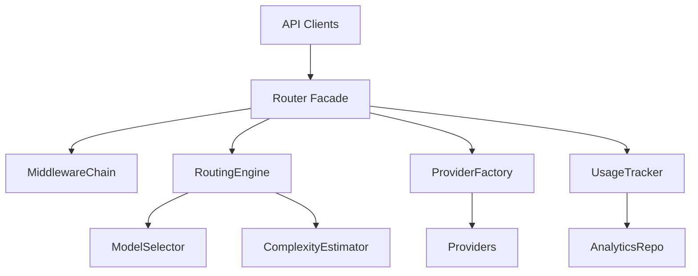
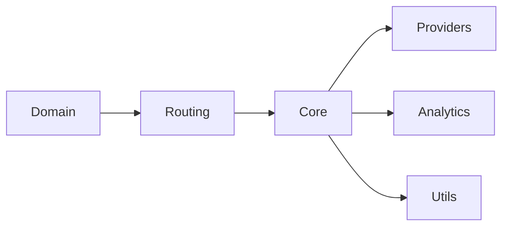
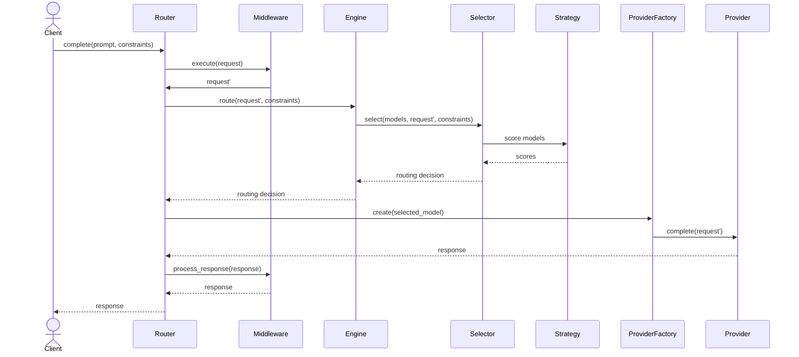

# Model Router Architecture

## Clean Architecture Layers

## SOLID Principles

1. **Single Responsibility**: `RoutingEngine` only coordinates routing; `ProviderFactory` only creates providers; `UsageTracker` only tracks analytics.
2. **Open/Closed**: Strategies, providers, middleware, and estimators can be added or replaced via DI without modifying existing code.
3. **Liskov Substitution**: Any class implementing `IProvider` or `IRoutingStrategy` can replace another without breaking consumers.
4. **Interface Segregation**: Separate protocols (providers, analytics, routing, middleware) prevent clients from depending on unused methods.
5. **Dependency Inversion**: Router, engine, and selectors depend on interfaces injected by `DIContainer` rather than concrete classes.

## Design Patterns Used

- **Strategy**: `IRoutingStrategy` implementations drive scoring variations (cost, quality, latency, balanced).
- **Factory**: `ProviderFactory` detects provider types, caches instances, and supplies them to the router.
- **Facade**: `Router` exposes a single `complete/chat` API over complex internals (providers, engine, middleware).
- **Template Method**: `BaseProvider` unifies retry/backoff/logging while subclasses implement `_make_api_call`.
- **Chain of Responsibility**: `MiddlewareChain` composes cross-cutting behaviors around request handling.

## Dependency Flow

## Sequence Diagram (Routing Flow)

## Extensibility

- **Add Providers**: Inherit from `BaseProvider`, implement `_make_api_call`, register a regex pattern + class in `ProviderFactory`.
- **Add Strategies**: Implement `IRoutingStrategy`, wire into `DIContainer` and `ModelSelector`.
- **Add Middlewares**: Implement `IMiddleware` pipes and include them in `MiddlewareChain`.
- **Add Analytics**: Implement `IAnalyticsRepository` or `IAnalyticsAggregator` variations and inject them via the container.

## Testing Strategy

- **Unit Tests**: Cover domain models, utilities, providers, strategies, selector, router, middleware, analytics, and DI wiring.
- **Integration Tests**: Validate router flows end-to-end with stubbed providers (integration marker), covering fallback, middleware, analytics, and constraint propagation.
